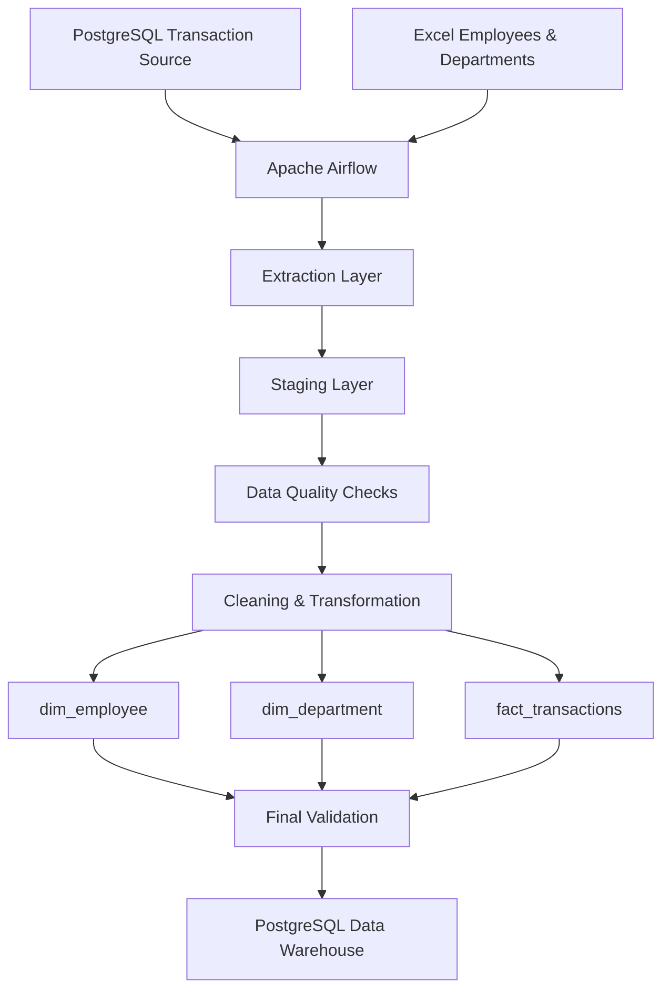
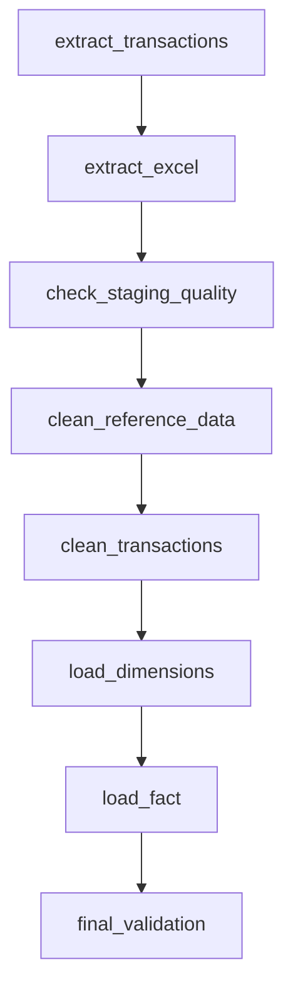
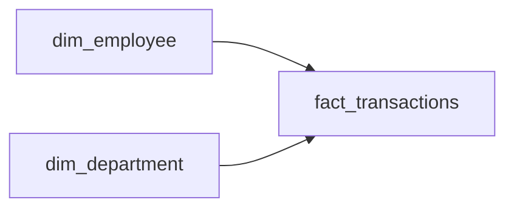
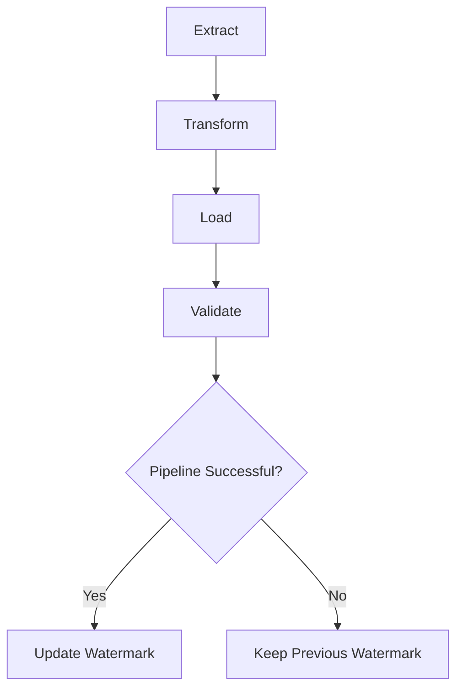

# Apache Airflow ETL Data Pipeline

An end-to-end Data Engineering project that processes transactional data from multiple sources and loads validated analytical data into a PostgreSQL Data Warehouse.

This project was developed as part of my Data Engineering learning journey and was inspired by the **Apache Airflow / orchestration module of the DataTalks.Club Data Engineering Zoomcamp**, with additional implementation and customization around data quality, dimensional modeling, incremental loading, watermarking, UPSERT logic, and pipeline validation.

---

## Project Overview

The project simulates a practical ETL workflow where transactional data is extracted from PostgreSQL and reference data is extracted from Excel.

The pipeline then:

- Loads source data into a staging layer
- Performs data quality checks
- Cleans and transforms the data
- Builds Dimension and Fact tables
- Supports incremental loading
- Tracks pipeline progress using a watermark
- Uses UPSERT logic for new and updated transactions
- Performs final validation before advancing the watermark

---

## Architecture



---

## Tech Stack

- Apache Airflow
- Python
- PostgreSQL
- SQL
- Docker
- Docker Compose
- Pandas
- Excel
- pgAdmin

---

## Data Sources

### PostgreSQL

The transactional source contains business transaction records including:

- Transaction ID
- Employee ID
- Transaction type
- Classification
- Priority
- Channel
- Region
- Status
- Amount
- Created timestamp
- Received timestamp
- Due timestamp
- Completed timestamp
- Last updated timestamp

### Excel

Excel is used as reference data for:

- Employees
- Departments

The dataset also contains intentionally introduced data quality issues to simulate realistic validation and cleaning scenarios.

---

## ETL Workflow

Airflow is responsible for orchestration, while the ETL logic is separated into individual Python scripts.



This design keeps the Airflow DAG focused on **workflow orchestration**, while the Python scripts handle the actual ETL operations.

---

## Staging Layer

Extracted data is first loaded into staging tables before transformation.

Examples:

```text
staging.transactions_raw
staging.employees_raw
staging.departments_raw
```

The staging layer separates source data from the final analytical model and provides a controlled area for validation and transformation.

---

## Data Quality Checks

The pipeline includes validation before loading data into the final Data Warehouse.

Examples of checks include:

- Duplicate transaction IDs
- Missing employee IDs
- Invalid department references
- Unexpected status values
- Negative or missing amounts
- Invalid timestamps
- Future dates
- Invalid employee records

Invalid records can be separated from valid records before loading into the final Fact and Dimension tables.

---

## Data Warehouse Model

The final analytical layer follows a dimensional modeling approach.



### Dimension Tables

```text
dw.dim_employee
dw.dim_department
```

### Fact Table

```text
dw.fact_transactions
```

The Fact table represents transaction events, while the Dimension tables provide descriptive information about employees and departments.

---

## Incremental Loading

The pipeline was initially implemented as a full-load process and later enhanced to support incremental loading.

Instead of processing the complete source dataset every time, the pipeline extracts only records that have changed since the previous successful run.

The main tracking column is:

```text
last_updated_at
```

Pipeline progress is stored in:

```text
dw.etl_control
```

using:

```text
last_successful_watermark
last_successful_run
```

The incremental extraction window follows this logic:

```text
last_successful_watermark
        <
last_updated_at
        <=
current_run_upper_bound
```

This reduces unnecessary processing and makes the pipeline more efficient.

---

## Watermark Strategy

The watermark represents the last successfully processed point in the source system.

The watermark is updated **only after the complete pipeline succeeds**.



This prevents the pipeline from skipping records if a failure occurs during processing.

---

## UPSERT Strategy

The Fact table uses UPSERT logic during incremental loads.

```text
New transaction
        → INSERT

Existing transaction changed
        → UPDATE

Unchanged transaction
        → No unnecessary reload
```

This allows the Data Warehouse to handle both newly created transactions and updates to existing records.

---

## Incremental Load vs Backfill

### Incremental Load

Used during normal scheduled pipeline execution.

```text
Process records changed since the last successful watermark.
```

### Backfill

Used when a specific historical period needs to be reprocessed.

```text
start_date → end_date
```

Historical backfills are designed not to modify the normal incremental watermark.

---

## Airflow Catchup

A separate learning DAG was created to understand Airflow Catchup behavior.

The project helped clarify the difference between:

**Schedule**

Determines when a DAG should run.

**Catchup**

Automatically creates missed scheduled runs.

**Backfill**

Intentionally reprocesses a selected historical period.

---

## Final Result

The pipeline successfully produces a validated analytical Data Warehouse containing approximately **112K transaction records**, together with Employee and Department dimensions.

The project demonstrates the complete flow:

```text
Operational Sources
        ↓
Extraction
        ↓
Staging
        ↓
Data Quality
        ↓
Transformation
        ↓
Dimensional Model
        ↓
Validated Data Warehouse
```

---

## Project Structure

```text
model-2-airflow/
│
├── dags/
│   └── transactions_etl_pipeline.py
│
├── scripts/
│   ├── db_config.py
│   ├── extract_transactions.py
│   ├── extract_excel.py
│   ├── check_staging_quality.py
│   ├── clean_reference_data.py
│   ├── clean_transactions.py
│   ├── load_dimensions.py
│   ├── load_fact.py
│   └── final_validation.py
│
├── sql/
│   ├── setup_source_db.sql
│   └── create_warehouse_schema.sql
│
├── examples/
│   └── learning/
│
├── .env.example
├── Dockerfile
├── docker-compose.yaml
└── README.md
```

---

## Running the Project

### 1. Create the environment file

Copy:

```text
.env.example
```

to:

```text
.env
```

and configure the required local credentials.

### 2. Build and start the environment

```bash
docker compose up -d --build
```

### 3. Check the running services

```bash
docker compose ps
```

### 4. Open Apache Airflow

Open the Airflow web interface and run:

```text
transactions_etl_pipeline
```

Airflow will orchestrate the extraction, validation, transformation, loading, and final validation steps.

---

## Key Concepts Practiced

- ETL
- Data Pipelines
- Workflow Orchestration
- Apache Airflow DAGs
- Docker
- PostgreSQL
- Staging Layer
- Data Quality
- Dimensional Modeling
- Fact & Dimension Tables
- Incremental Loading
- Watermarking
- UPSERT
- Backfill
- Catchup
- Retry
- Pipeline Validation

---

## Security

Credentials and environment-specific secrets are not stored directly in the source code.

The project uses environment variables through:

```text
.env
```

A safe template is provided through:

```text
.env.example
```

The real `.env` file is excluded from Git.

---

## Learning Reference

This project was developed as part of my Data Engineering learning journey.

The Apache Airflow and orchestration concepts were based on:

**Data Engineering Zoomcamp — DataTalks.Club**

The learning material was extended with a customized transaction-processing scenario including:

- PostgreSQL and Excel data sources
- Data quality validation
- Staging tables
- Dimensional modeling
- Incremental loading
- Watermark management
- UPSERT logic
- Backfill and Catchup exercises
- Final pipeline validation

---

## Future Improvements

Possible next steps for the project include:

- Integrating dbt for warehouse transformations
- Adding automated dbt tests
- Connecting the Data Warehouse to Power BI
- Adding CI/CD validation
- Moving the architecture to Azure cloud services